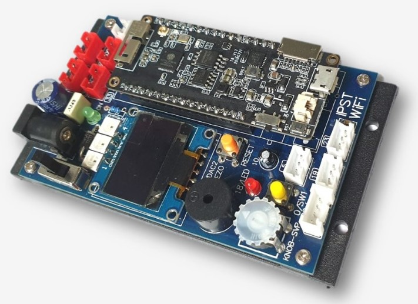

# MicroPython IPST-WiFi
  ใช้สำหรับภาษา microPython ประกอบด้วย ipst-WiFi <br>
    
  ### เริ่มต้น
  ```blocks
  import ipstw  
  w=ipstw.IPSTW()
  w.begin() 
  ```
### ตัวอย่าง คำสั่ง OK() 
 ```blocks
 w.OK() #เมื่อเรียกใช้โปรแกรมจะหยุดที่คำสั่งจนกว่าจะกด สวิตช์ SW1 หน้าจอ OLED จะข้อความ "Press SW1 For Start"
 ```
### ตัวอย่าง อ่านค่าดิจิตอล 
```blocks
  w= i.input(5)   #อ่านค่า input จากบอร์ด ipst-wifi พอร์ตหมายเลข 5 
  w= i.IN(5)   #อ่านค่า input จากบอร์ด ipst-wifi พอร์ตหมายเลข 5
 ```
 ### ตัวอย่าง กำหนดขาดิจิตอล 
 ```blocks
  w.output(5,1)   #กำหนดลอจิก 1 ที่พอร์ตหมายเลข 5 บนบอร์ด ipst-wifi 
  w.OUT(5,1)   #กำหนดลอจิก 1 ที่พอร์ตหมายเลข 5 บนบอร์ด ipst-wifi
  ```
### ตัวอย่าง อ่านค่า SW1 บนบอร์ด ipst-wifi
 ```blocks
 x= w.sw1()   #อ่านค่าสถานะสวิตช์ SW1 
  ```
### ตัวอย่าง อ่านค่า Analog 
 ```blocks
  x= w.analog(34)  #อ่านค่า analog จากบอร์ด ipst-wifi พอร์ตหมายเลข 34 การคืนค่า การคืนค่า 0-1023 
  ```
### ตัวอย่าง อ่านค่า KNOB บนบอร์ด ipst-wifi
 ```blocks
  x=w.knob()  #การคืนค่า 0-4095 
  x=w.knob(-100,100)  #การคืนค่า -100 ถึง 100
 ```
 ### ตัวอย่าง กำหนดสี SLED บนบอร์ด ipst-wifi
 ค่าที่กำนดสี 0-255
 ```blocks
  w.sled(0,(10,0,0)) #กำหนดดวงที่ 1 เป็นสี แดง
  w.sled(1,(0,10,0)) #กำหนดดวงที่ 2 เป็นสี เขียว
  w.sled(2,(0,0,10)) ##กำหนดดวงที่ 3 เป็นสี น้ำเงิน
 ```
### ตัวอย่าง การใช้งานแสดงข้อความบนจอ OLED
 ```blocks
  w.fill(0)   #ลบการแสดงข้อความบนหน้าจอ OLED 
  w.text("i-Rover",0,1)  #แสดงข้อความ i-Rover ที่ตำแหน่งพิกเซล x=0,y=1 
  w.show() #แสดงข้อความออกทางหน้าจอ
   ```
